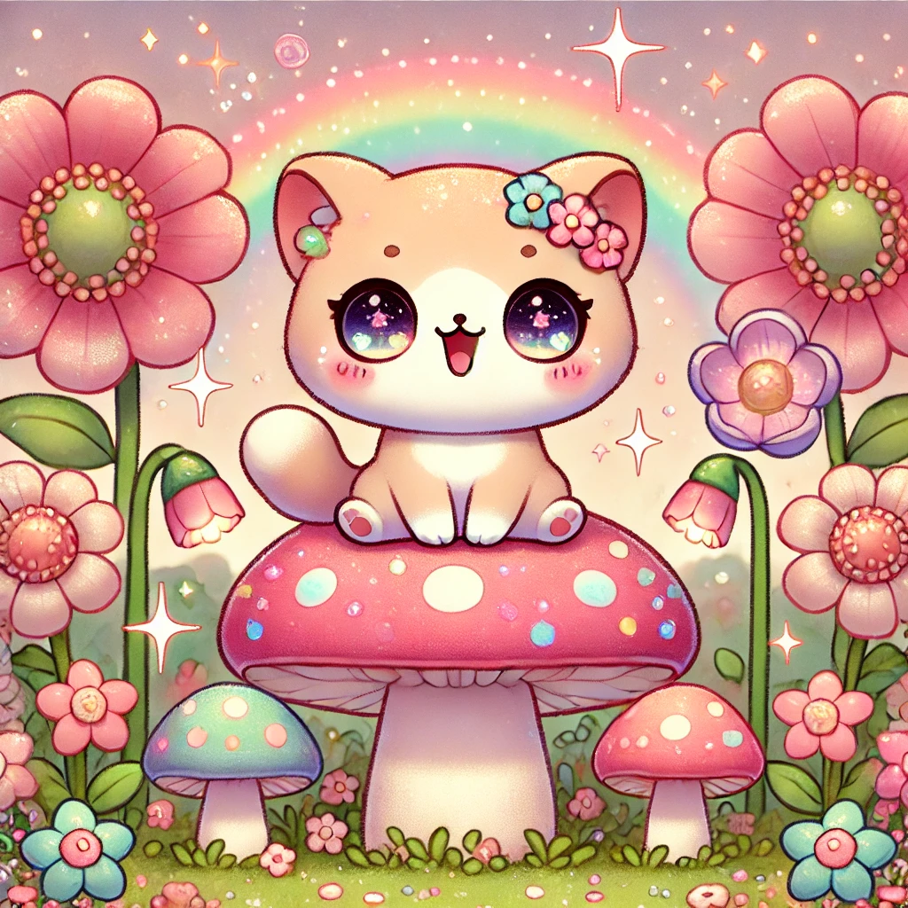

Kitty Tap
=========

An idle clicker game where you tap on a mushroom with cats.

## Design

### Color Pallete

I have extracted a color pallete from this image:

The pallete that was selected based on this image is:

https://coolors.co/palette/d47271-6a5061-f1ae96-acb25c-443120

- `#D47271`
  - `50`: `#fbf1f1`
  - `100`: `#f6e3e3`
  - `200`: `#eec7c6`
  - `300`: `#e5aaaa`
  - `400`: `#dd8e8d`
  - `500`: `#d47271`
  - `600`: `#aa5b5a`
  - `700`: `#7f4444`
  - `800`: `#552e2d`
  - `900`: `#2a1717`
- `#6A5061`
  - `50`: `#f0eeef`
  - `100`: `#e1dcdf`
  - `200`: `#c3b9c0`
  - `300`: `#a696a0`
  - `400`: `#887381`
  - `500`: `#6a5061`
  - `600`: `#55404e`
  - `700`: `#40303a`
  - `800`: `#2a2027`
  - `900`: `#151013`
- `#F1AE96`
  - `50`: `#fef7f5`
  - `100`: `#fcefea`
  - `200`: `#f9dfd5`
  - `300`: `#f7cec0`
  - `400`: `#f4beab`
  - `500`: `#f1ae96`
  - `600`: `#c18b78`
  - `700`: `#91685a`
  - `800`: `#60463c`
  - `900`: `#30231e`
- `#ACB25C`
  - `50`: `#f7f7ef`
  - `100`: `#eef0de`
  - `200`: `#dee0be`
  - `300`: `#cdd19d`
  - `400`: `#bdc17d`
  - `500`: `#acb25c`
  - `600`: `#8a8e4a`
  - `700`: `#676b37`
  - `800`: `#454725`
  - `900`: `#222412`
- `#443120`
  - `50`: `#eceae9`
  - `100`: `#dad6d2`
  - `200`: `#b4ada6`
  - `300`: `#8f8379`
  - `400`: `#695a4d`
  - `500`: `#443120`
  - `600`: `#36271a`
  - `700`: `#291d13`
  - `800`: `#1b140d`
  - `900`: `#0e0a06`

